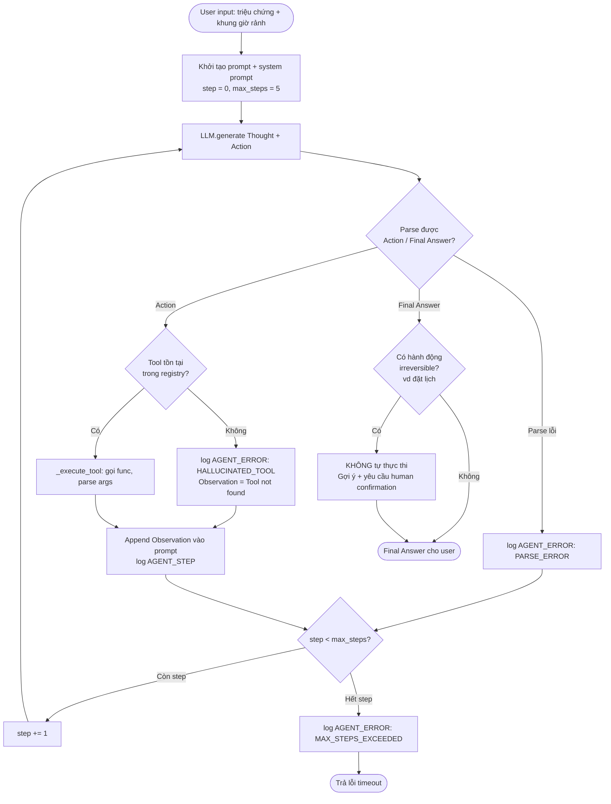
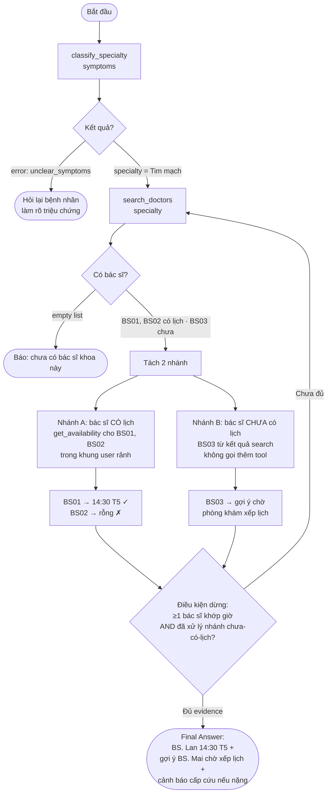

# Flowchart — Doctor-Finder ReAct Agent

Luồng xử lý của agent theo kịch bản (đính kèm cùng trace cho Deliverable cuối ngày).

## 1. Vòng lặp ReAct tổng quát (generic loop + guardrail)

## 2. Luồng quyết định nghiệp vụ (đúng trace mẫu)

## Điểm grounding & an toàn (bám rubric)
- **Thứ tự tool đúng:** classify → search → availability (không gọi sai thứ tự).
- **Không bịa dữ liệu:** mọi slot đều từ Observation.
- **Guardrail:** agent KHÔNG tự đặt lịch — booking irreversible, cần human confirmation.
- **Điều kiện dừng rõ ràng:** đủ evidence (≥1 bác sĩ khớp giờ + xử lý xong nhánh chưa-có-lịch) → dừng, không gọi thừa tool.
